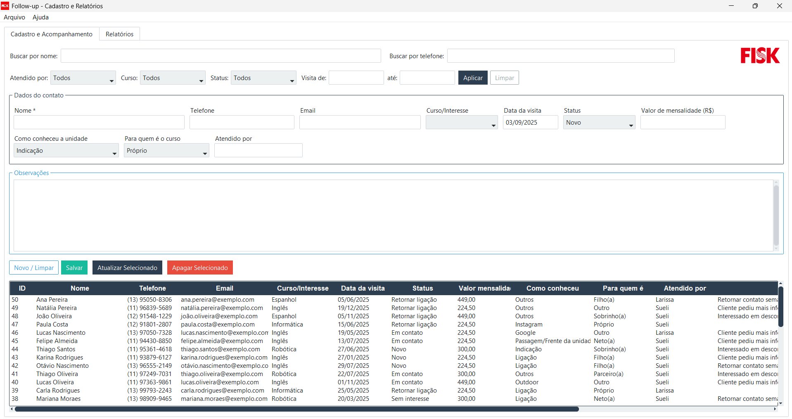
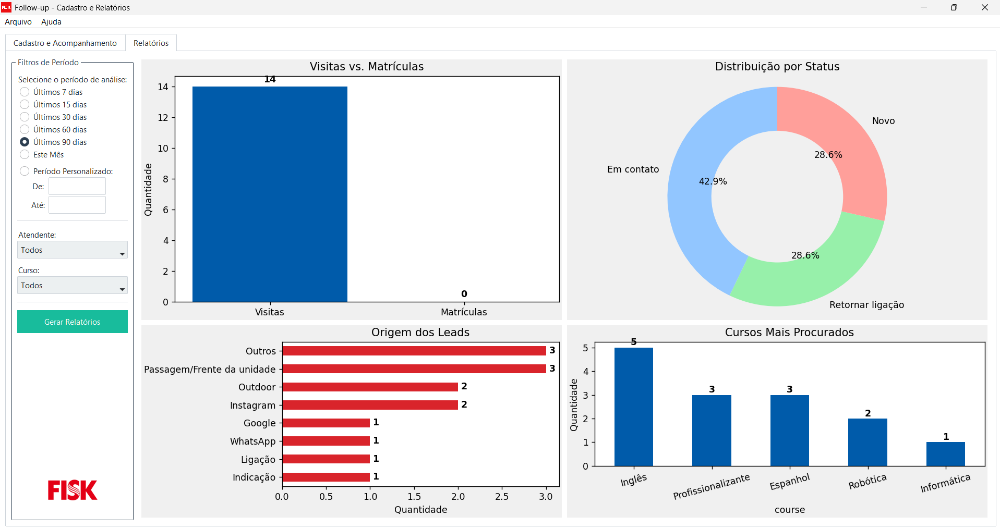

# Follow-Up Desktop App


Sistema de desktop para gerenciamento e acompanhamento de atividades (follow-ups), desenvolvido com foco em robustez, usabilidade e manutenibilidade.

A aplicação foi projetada para oferecer uma solução local e eficiente para controle de registros, implementando um sistema de **CRUD** completo com persistência de dados em um banco de dados relacional **SQLite**. A interface gráfica, construída com **PySide6**, foi pensada para ser intuitiva, facilitando o uso por usuários não técnicos.


---

## 🎯 Funcionalidades Principais

* **Interface Gráfica Intuitiva:** UI limpa e objetiva, desenvolvida com PySide6 (Qt for Python), focada na experiência do usuário.
* **Operações CRUD Completas:** Implementação de todas as operações essenciais de manipulação de dados:
    * **C**reate (Criar): Adição de novos registros de follow-up.
    * **R**ead (Ler): Visualização e busca de registros existentes.
    * **U**pdate (Atualizar): Edição de informações dos registros.
    * **D**elete (Deletar): Exclusão de registros.
* **Persistência de Dados Confiável:** Utiliza um banco de dados relacional (SQLite) para garantir a integridade e a consistência dos dados, aderindo a princípios transacionais (**ACID** - Atomicidade, Consistência, Isolamento e Durabilidade).
* **Exportação de Dados:** Funcionalidade para exportar a base de dados completa, permitindo a extração de dados para backups ou análises externas (um processo análogo a uma operação de **ETL** - Extract, Transform, Load).
* **Instalador Simplificado:** Um instalador executável (`.exe`), criado com Inno Setup, que automatiza o processo de instalação e configuração do ambiente para o usuário final.

---

## 🛠️ Arquitetura e Conceitos Técnicos

Este projeto foi além da simples implementação de funcionalidades, incorporando boas práticas de desenvolvimento para garantir um software de qualidade.

* **Banco de Dados Relacional (SQLite):** A escolha pelo SQLite como SGBD se deu pela sua simplicidade, portabilidade e eficiência em aplicações desktop. O banco de dados armazena os dados de forma estruturada, permitindo consultas complexas e garantindo a integridade referencial dos dados.

* **Camada de Persistência de Dados:** Toda a interação com o banco de dados é centralizada em um módulo dedicado (`database.py`), abstraindo a lógica de SQL do restante da aplicação. Essa separação de responsabilidades torna o código mais limpo, seguro contra SQL Injection (com o uso de placeholders) e facilita futuras migrações de banco, se necessário.

* **Modularização e Manutenibilidade:** O código é estruturado de forma modular, separando as responsabilidades:
    1.  **Interface do Usuário (UI):** Arquivos `.ui` (criados no Qt Designer) e classes Python que gerenciam a lógica da interface.
    2.  **Lógica de Negócio:** Funções que orquestram as operações e regras da aplicação.
    3.  **Acesso aos Dados:** A camada de persistência que lida exclusivamente com o banco de dados.

    Essa abordagem facilita a manutenção, a escalabilidade e a implementação de novos recursos sem impactar outras partes do sistema.

---

## 🚀 Tecnologias Utilizadas

| Tecnologia | Finalidade |
| :--- | :--- |
| **Python** | Linguagem principal do projeto |
| **PySide6** | Biblioteca para a criação da interface gráfica (bindings oficiais do Qt) |
| **SQLite3** | Banco de dados relacional embarcado para persistência de dados |
| **Qt Designer** | Ferramenta visual para o design das janelas da aplicação |
| **Inno Setup** | Ferramenta para criação do instalador para Windows |

---

## 🖼️ Screenshots da Aplicação

| Tela Principal | Tela de Cadastro/Edição |
| :---: | :---: |
|  |  |

---

## ⚙️ Instalação e Execução

Existem duas formas de utilizar a aplicação: através do instalador ou executando o código-fonte diretamente.

### Para Usuários Finais

1.  Acesse a seção de [**Releases**](https://github.com/gustavochotti/follow-up-desktop-app/releases) deste repositório.
2.  Baixe o arquivo `setup-follow-up-app.exe`.
3.  Execute o instalador e siga as instruções na tela.

### Para Desenvolvedores

**Pré-requisitos:**
* Python 3.10 ou superior
* Git

**Passo a passo:**
```bash
# 1. Clone o repositório
git clone [https://github.com/gustavochotti/follow-up-desktop-app.git](https://github.com/gustavochotti/follow-up-desktop-app.git)

# 2. Acesse o diretório do projeto
cd follow-up-desktop-app

# 3. Crie e ative um ambiente virtual (recomendado)
python -m venv venv
# No Windows:
venv\Scripts\activate
# No Linux/macOS:
source venv/bin/activate

# 4. Instale as dependências
pip install -r requirements.txt

# 5. Execute a aplicação
python src/main.py
```

---

## 📊 Potencial para Aplicações Analíticas
Embora seja uma aplicação transacional (OLTP), os dados coletados por este sistema possuem um grande potencial analítico (OLAP). A funcionalidade de exportação é o primeiro passo para habilitar análises mais profundas.

- **Pipeline de ETL:** A extração do banco de dados pode ser o ponto de partida para um pipeline de ETL, onde os dados seriam transformados e carregados em um data warehouse ou data lake para análises consolidadas.
- **Análise de Dados:** Os dados podem ser utilizados para gerar dashboards em ferramentas como Power BI ou Tableau, ou analisados com bibliotecas Python (Pandas, Matplotlib, Seaborn) para responder a perguntas de negócio, como:
  - Qual a frequência de follow-ups por categoria?
  - Qual o tempo médio para conclusão de uma atividade?
  - Existem padrões ou sazonalidades nos registros?
- **Machine Learning:** Em uma escala maior, o histórico de dados poderia ser usado para treinar modelos preditivos, como prever a probabilidade de atraso em determinadas tarefas ou identificar anomalias nos registros.

---

## 👨‍💻 Autor
**Gustavo Chotti** 

---

## 📄 Licença
Este projeto está sob a licença MIT. Veja o arquivo LICENSE para mais detalhes.
